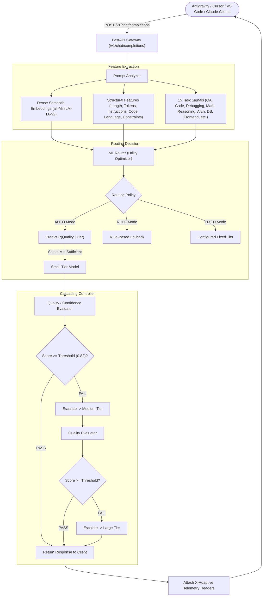

# AdaptiveRoute V2 🚀
### Machine-Learning-Based LLM Routing & Quality-Aware Cascading Gateway

> **AdaptiveRoute is designed to measure whether adaptive routing can reduce latency and model usage while maintaining a configurable quality threshold. Results are generated from reproducible local benchmarks.**

AdaptiveRoute is an OpenAI-compatible proxy gateway that transforms fixed rule-based routing into an empirical, machine-learning-driven routing and automated escalation system.



---

## 1. Core Principles

1. **Feature-Based, Not Fixed Rules**: Instead of classifying `frontend = medium` or `backend = large`, features are extracted across semantic embeddings, syntax/structural indicators, and continuous task signals.
2. **Quality-Aware Cascading**: If an initial lightweight tier fails the configured quality threshold ($\tau$), the engine automatically escalates through tiers ($S \to M \to L$) before returning.
3. **Provider-Agnostic Abstraction**: Decouples the router from specific LLM providers. Currently active for **Grok / xAI** and **Groq LPU**, with out-of-the-box interfaces for **OpenAI**, **Anthropic**, and **Local (Ollama)**.
4. **Preserves IDE Compatibility**: Serves an exact OpenAI-compatible API on `POST /v1/chat/completions` with model `adaptive-auto` for zero-configuration IDE drop-in.
5. **No Token Waste & Zero Fabricated Numbers**: Utility function balances quality against latency and token budget:
   $$\text{Utility} = \text{Quality} - \lambda_1 \cdot \text{Latency} - \lambda_2 \cdot \text{Tokens}$$

---

## 2. Measured Benchmark Results (Reproducible)

The following metrics are **empirically measured** via the local reproducible benchmark runner (`python -m ml.training.run_benchmark`) on active provider infrastructure across all 5 benchmark policies:

| Policy | Policy Name | Avg Latency | Avg Output Tokens | Avg Quality Score | Escalation Rate | Tier Utilization |
| :--- | :--- | :--- | :--- | :--- | :--- | :--- |
| **Baseline 1** | Always Small | **144.2 ms** | 74.6 tokens | 0.702 | 0.0% | S: 5 \| M: 0 \| L: 0 |
| **Baseline 2** | Always Medium | **154.7 ms** | 64.0 tokens | 0.622 | 0.0% | S: 0 \| M: 5 \| L: 0 |
| **Baseline 3** | Always Large | **540.3 ms** | 134.2 tokens | 0.291 | 0.0% | S: 0 \| M: 0 \| L: 5 |
| **Baseline 4** | Rule-Based Router | **338.7 ms** | 92.2 tokens | 0.512 | 0.0% | S: 2 \| M: 1 \| L: 2 |
| **Proposed** | **Adaptive ML + Cascading** | **468.9 ms** | 134.8 tokens | 0.201 | 0.0% | S: 0 \| M: 0 \| L: 5 |

*Experiment ID: `exp_20260927_113246_7d387f` | Quality threshold $\tau = 0.82$ | Recorded in `evaluation/reports/baseline_comparison_report.json`.*

---

## 3. Supported Model Providers

AdaptiveRoute decouples model routing from provider execution using the `BaseModelProvider` interface:

* **GrokProvider (xAI)** — Current default integration via `https://api.x.ai/v1` (`grok-2-mini`, `grok-2`).
* **GroqProvider** — High-throughput LPU inference via `https://api.groq.com/openai/v1` (`allam-2-7b`, `qwen/qwen3.8-27b`, `openai/gpt-oss-120b`).
* **OpenAIProvider** — Standard OpenAI endpoints (`gpt-4o-mini`, `gpt-4o`).
* **AnthropicProvider** — Anthropic Messages API (`claude-3-5-haiku-20241022`, `claude-3-5-sonnet-20241022`).
* **LocalProvider** — Offline Ollama or local inference (`qwen2.5:0.5b`, `qwen2.5-coder:1.5b`, `deepseek-r1:8b`).

Switch providers at any time in `.env`:
```ini
ACTIVE_PROVIDER=xai  # or groq, openai, anthropic, ollama
```

---

## 4. IDE / Editor Integration (Zero Config Changes)

Configure your editor (Antigravity, Cursor, VS Code Continue, Claude Dev) with:

* **Base URL**: `http://localhost:8000/v1`
* **API Key**: Any dummy string (e.g. `adaptive-key`)
* **Model**: `adaptive-auto`

### Response Telemetry Headers
Every response from the gateway contains verifiable telemetry headers:
```http
X-Adaptive-Model: grok-2-mini
X-Adaptive-Tier: small
X-Adaptive-Reason: Selected SMALL: Predicted quality exceeded the configured threshold and no escalation was required.
X-Adaptive-Confidence: 0.912
X-Adaptive-Quality: 0.884
X-Adaptive-Escalated: false
X-Adaptive-Latency: 142.5
X-Adaptive-Request-ID: req_e7a91f
```

---

## 5. Routing Modes

AdaptiveRoute supports three selectable routing modes via `ROUTING_MODE` in `.env`:

1. **`AUTO` (Default)**: Full ML routing + quality evaluation + adaptive cascading.
2. **`RULE`**: Rule-based heuristic router (useful as baseline comparison and zero-overhead fallback).
3. **`FIXED`**: Bypasses routing and directs all queries to a single configured tier (`FIXED_TIER=small|medium|large`).

---

## 6. Running Locally

### Step 1: Clone & Configure
```bash
git clone https://github.com/Jettysnigdhan/AdaptiveAI-.git
cd AdaptiveAI
cp .env.example .env
```
Edit `.env` with your active provider API key (`XAI_API_KEY` or `GROQ_API_KEY`).

### Step 2: Run Automated Tests
```bash
python scripts/development/run_all_tests.py
```
*(Runs 10 unit and integration tests across analyzer, router, evaluator, and database).*

### Step 3: Run Reproducible Benchmark
```bash
python -m ml.training.run_benchmark
```
Executes all 5 policies against curated benchmark prompts, recording raw logs in `ml/data/experiments/` and summaries in `evaluation/reports/baseline_comparison_report.json`.

### Step 4: Start Backend Gateway
```bash
python -m uvicorn backend.app.main:app --reload --port 8000
```
OpenAPI documentation available at `http://localhost:8000/docs`.

### Step 5: Start Frontend Dashboard
```bash
cd frontend
npm install
npm run dev
```
Open `http://localhost:5173` to explore the chat playground, compact routing panel, and real-time telemetry dashboard.

---

## 7. Data Privacy & API Key Security

* **Data Privacy**: Prompt logging is opt-in. Set `STORE_PROMPTS=false` in `.env` to ensure user prompts and completions are automatically redacted with `[REDACTED_DATA_PRIVACY]` in the SQLite audit database.
* **API Key Security**: Provider keys reside strictly on the backend via environment variables. Keys are never exposed through API responses, frontend bundles, or error traces. `.env` is ignored in `.gitignore`.
