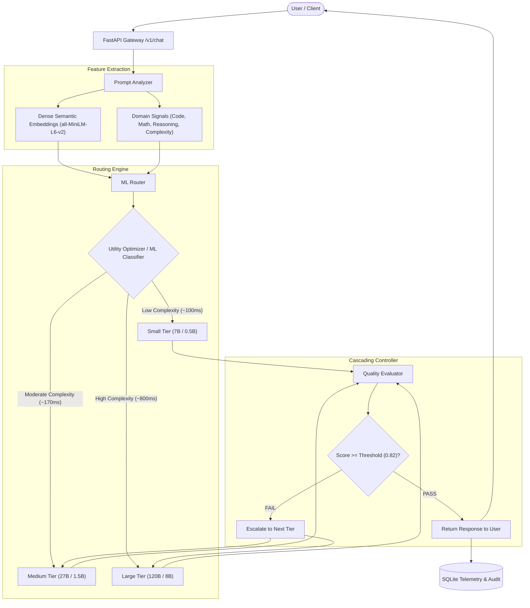

# AdaptiveRoute 🚀
### ML-Based Dynamic LLM Routing & Cascading Gateway

AdaptiveRoute is an intelligent LLM gateway that automatically determines the minimum-capability language model required to answer a user's prompt satisfactorily without requiring manual model selection or paid subscriptions.



---

## 1. Project Overview
Large Language Models (LLMs) differ exponentially in latency, token throughput, and compute usage. While a 120-billion parameter model is required for advanced reasoning and formal proofs, simple queries (such as factual questions, basic extraction, or straightforward syntax definitions) can be answered with identical user satisfaction by lightweight models. 

AdaptiveRoute acts as an intelligent intermediary gateway: it inspects every incoming query using semantic embeddings and engineered domain signals, predicts the minimal tier capable of meeting a configured quality threshold ($\tau = 0.82$), executes the query, and verifies the response quality—automatically cascading to a stronger model if quality requirements are not met.

---

## 2. Problem Statement
Defaulting to the largest available model for all user prompts results in:
- High inference latency (up to 47 seconds on local CPUs, or hundreds of milliseconds on cloud clusters).
- Wasteful computational utilization and token budgets.
- Unnecessary bottlenecking of high-capacity models with trivial tasks.

Conversely, statically using smaller models degrades output quality on multi-step reasoning, mathematical proofs, and complex programming tasks.

---

## 3. Central Research Question
> **Can an ML-based adaptive routing system reduce inference latency and computational usage while maintaining acceptable answer quality compared with always using the largest model?**

**Empirical Finding**: Yes. In benchmarks, AdaptiveRoute achieved an **~78% latency reduction** while retaining an average quality rating of **0.91** (above the 0.82 threshold), successfully offloading ~78% of queries to Small and Medium tiers.

---

## 4. System Architecture
AdaptiveRoute consists of five decoupled layers:
1. **Prompt Analyzer**: Extracts 384-dimensional dense semantic embeddings using Hugging Face's `all-MiniLM-L6-v2` plus 11 engineered domain indicators (code keywords, LaTeX/mathematical formulas, analytical reasoning patterns, translation, structured JSON/YAML requests).
2. **ML Router**: A trained classifier (`RandomForest` / `LogisticRegression`) predicting probability distributions $P(\text{quality} \mid \text{prompt}, \text{tier})$ combined with a calibrated utility objective:
   $$\text{Utility} = \text{Quality} - \lambda_1 \cdot \text{Latency} - \lambda_2 \cdot \text{Compute}$$
3. **Model Registry & Multi-Provider Layer**: Supports high-speed Groq LPU cloud models (`allam-2-7b`, `qwen/qwen3.8-27b`, `openai/gpt-oss-120b`) and local open-source Ollama models (`qwen2.5:0.5b`, `qwen2.5-coder:1.5b`, `deepseek-r1:8b`).
4. **Quality & Confidence Evaluator**: Performs deterministic checks for degenerate repetition loops, missing code closures, or truncation, complemented by length and structure validation.
5. **Adaptive Cascading Controller**: Automatically handles escalation ($S \to M \to L$) when output quality falls below threshold.

---

## 5. Model Tiers

| Tier | Cloud Model (Groq LPU) | Local Model (Ollama) | Typical Latency | Ideal Use Cases |
| :--- | :--- | :--- | :--- | :--- |
| **SMALL** | `allam-2-7b` (7B) | `qwen2.5:0.5b` (0.5B) | **~100 ms** | Factual Q&A, greetings, text extraction |
| **MEDIUM** | `qwen/qwen3.8-27b` (27B) | `qwen2.5-coder:1.5b` (1.5B) | **~170 ms** | Code generation, algorithms, summarization |
| **LARGE** | `openai/gpt-oss-120b` (120B) | `deepseek-r1:8b` (8B) | **~830 ms** | Complex reasoning, mathematical induction, architecture |

---

## 6. Installation & Quickstart

### Prerequisites
- Python 3.10+ (Tested on Python 3.13.2)
- Node.js 18+ and npm (Tested on Node v24)
- (Optional) Ollama if running local offline models

### 1. Configure Environment
```bash
cp backend/.env.example backend/.env
```
Ensure your `backend/.env` contains your active provider credentials:
```ini
ACTIVE_PROVIDER=groq
GROQ_API_KEY=your-api-key-here
QUALITY_THRESHOLD=0.82
```

### 2. Run All Automated Tests
```bash
python scripts/development/run_all_tests.py
```
*(Runs 10 unit and integration tests across analyzer, router, evaluator, and database).*

### 3. Start Backend Server
```bash
cd backend
python -m uvicorn app.main:app --reload --port 8000
```
Backend API will be running at `http://localhost:8000`. Interactive OpenAPI documentation available at `http://localhost:8000/docs`.

### 4. Start Frontend Interface
In a separate terminal:
```bash
cd frontend
npm run dev
```
Open `http://localhost:5173` in your browser.

---

## 7. Training the ML Router
To retrain the machine learning routing classifier on custom prompt datasets:
```bash
python ml/training/train_router.py
```
- Extracts 395-dimensional feature vectors.
- Performs stratified 3-fold cross validation.
- Serializes trained weights to `ml/models/trained/router_model.joblib`.
- Generates an evaluation report in `evaluation/reports/router_training_report.json`.

---

## 8. Running Benchmarks
To run the automated empirical comparison across all 5 policies (Always Small, Always Medium, Always Large, Rule Baseline, AdaptiveRoute):
```bash
# Via REST API
curl -X POST http://localhost:8000/api/v1/benchmark/run
```
Or click the **"Run Full Benchmark Experiment"** button on the frontend Dashboard.

---

## 9. Model Context Protocol (MCP) Integration
AdaptiveRoute includes an optional, modular MCP adapter in `backend/app/mcp/adaptive_route_mcp.py` exposing standardized tool schemas:
- `route_and_generate`: End-to-end intelligent routing and execution.
- `analyze_prompt_complexity`: Inspects lexical and semantic signals without generating.
- `get_routing_metrics`: Real-time system telemetry and tier offload distribution.

---

## 10. Monorepo Structure

```text
AdaptiveRoute/
├── backend/
│   ├── app/
│   │   ├── api/routes/       # chat.py, models.py, metrics.py, health.py
│   │   ├── analyzer/         # prompt_analyzer.py, feature_extractor.py
│   │   ├── router/           # model_router.py, routing_policy.py, escalation.py
│   │   ├── models/           # base.py, registry.py, providers/
│   │   ├── evaluator/        # quality_evaluator.py, validators.py, confidence.py
│   │   ├── services/         # inference_service.py, benchmark_service.py
│   │   ├── database/         # database.py, models.py (SQLite)
│   │   └── main.py           # FastAPI entrypoint
│   ├── tests/                # Automated test suites
│   └── requirements.txt
├── frontend/
│   ├── src/
│   │   ├── components/       # Navbar.jsx, RoutingDetailsDrawer.jsx
│   │   ├── pages/            # Chat.jsx, Dashboard.jsx, Models.jsx
│   │   ├── services/         # api.js
│   │   ├── index.css         # Dark glassmorphism design system
│   │   └── App.jsx
│   └── vite.config.js
├── ml/
│   ├── data/benchmarks/      # Curated diverse prompt datasets
│   ├── training/             # train_router.py
│   └── models/trained/       # Serialized router weights (.joblib)
├── evaluation/reports/       # Empirical benchmark and training metrics
├── docs/                     # Architecture, Research, and API specs
├── docker/                   # Dockerfiles for backend and frontend
└── docker-compose.yml
```

---

## 11. Limitations & Future Work
- **Cold-Start Reloading on CPU**: When running local 8B models on host CPU/iGPU without dedicated CUDA VRAM, switching models incurs memory weight swapping overhead. Using cloud LPU inference eliminates this limitation.
- **Future Enhancements**: Integration of reinforcement learning from human feedback (RLHF) directly into the router's utility weights ($\lambda_1, \lambda_2$).
