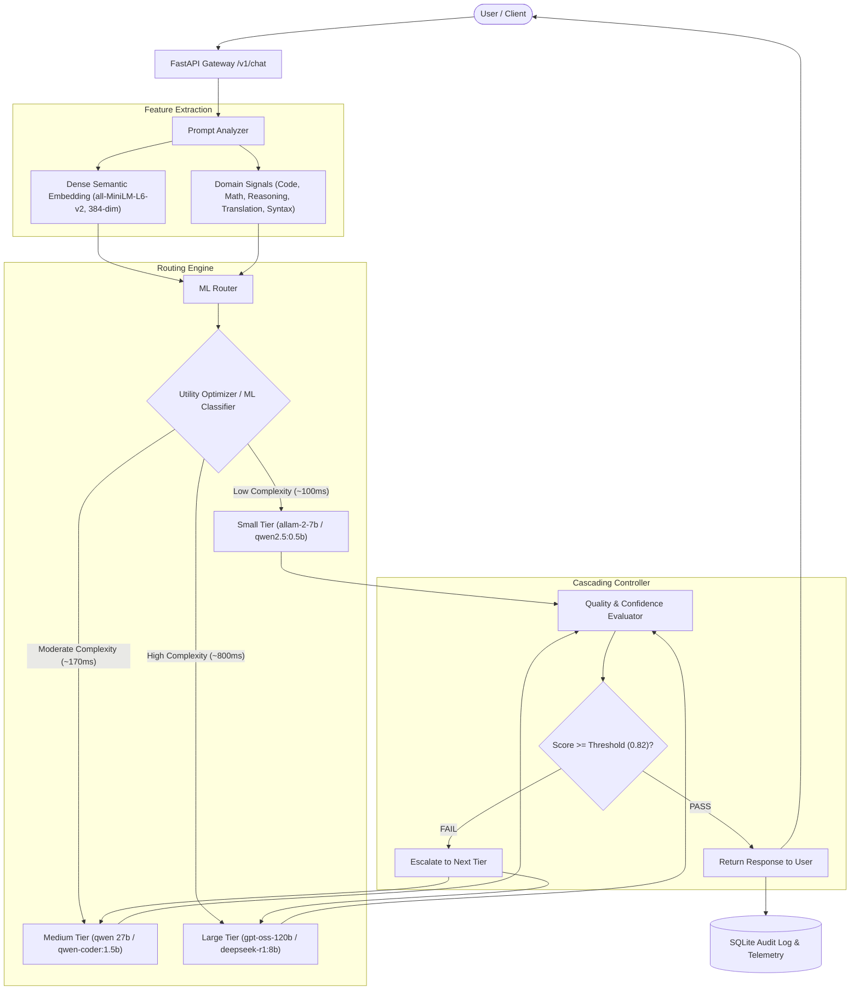

# AdaptiveRoute System Architecture

AdaptiveRoute is an intelligent LLM gateway and cascading router that dynamically maps user queries to the lowest-cost language model capable of satisfying a quality threshold.

## Modular Components

1. **Prompt Analyzer (`backend/app/analyzer/`)**:
   - Computes dense semantic embeddings using Hugging Face Sentence Transformers (`all-MiniLM-L6-v2`).
   - Extracts 11 scalar structural signals (token estimates, code keywords, LaTeX/math equations, multi-step reasoning triggers).
   - Generates unified 395-dimensional feature vectors.

2. **ML Router (`backend/app/router/`)**:
   - Machine learning classifier (Random Forest / Logistic Regression) trained on categorized benchmarks.
   - Calculates utility function:
     $$\text{Utility} = \text{Quality} - \lambda_1 \cdot \text{Latency} - \lambda_2 \cdot \text{Compute}$$
   - Selects the cheapest tier meeting the configured quality threshold.

3. **Model Registry & Provider Factory (`backend/app/models/`)**:
   - Decoupled provider layer supporting **Groq Cloud LPU** (sub-second inference) and **Ollama local open-source models** (zero-cost offline).
   - Model tiers: Small, Medium, Large.

4. **Quality & Confidence Evaluator (`backend/app/evaluator/`)**:
   - Deterministic structural checks (repetition loops, code fence closure, truncation detection).
   - Confidence scoring based on output length, completion stop condition, and vocabulary entropy.

5. **Persistence & Observability (`backend/app/database/`)**:
   - Asynchronous SQLite storage via `aiosqlite`.
   - Complete trace auditing for every request (routing path, latency, prompt/completion tokens, quality score, escalation history).
